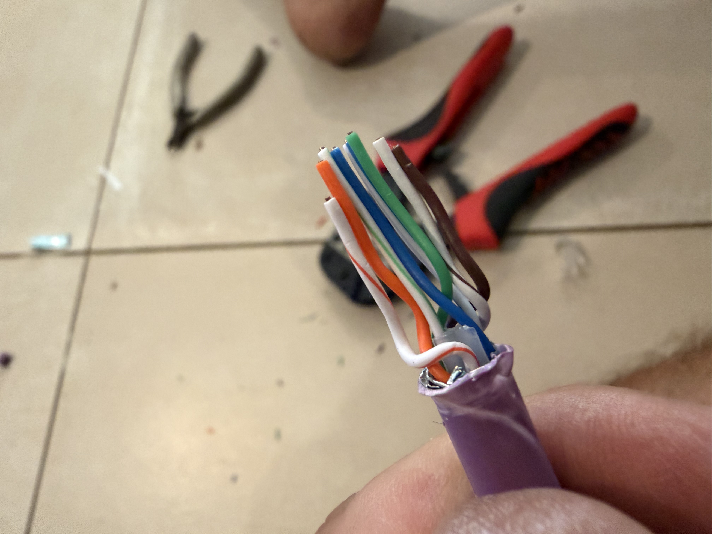

{{}}

Aujourd’hui c’était opération câblage à la maison. Les étapes sont claires : passer les câbles en rampant dans les combles, clairement le plus dur / pénible. Puis sertir les câbles et régler les VLAN.
Les câbles sont passés, plus de peur que de mal. Le plus pénible est passé, une douche et on attaque la partie fun.
C’est une découverte pour moi, mais après 3 vidéo YouTube, j’attaque mon premier câble confiant. 
Échec 1, je pince trop fort pour dénuder et ’enta tout. Qu’à cela ne tienne, je coupe et je recommence. Gaine retirée, je met les fils dans l’ordre, je les aligne, je les insère dans le connecteur. Je serti… ou pas… pas assez enfoncés.Je recommence et la c’est le drame. Fil pliés, qui s’emmêlent, qui s’inversent.
Et une fois sertit, le suspense jusqu’au branchement….
Bilan de l’opération : 
 * un connecteur utilisé pour rien
 * 5 connecteurs sertis / 10
 * 1 cable testé fonctionnel
 * 5h de travail
 * pas envie de continuer

Chapeau à tous ceux qui font de cette torture leur quotidien.